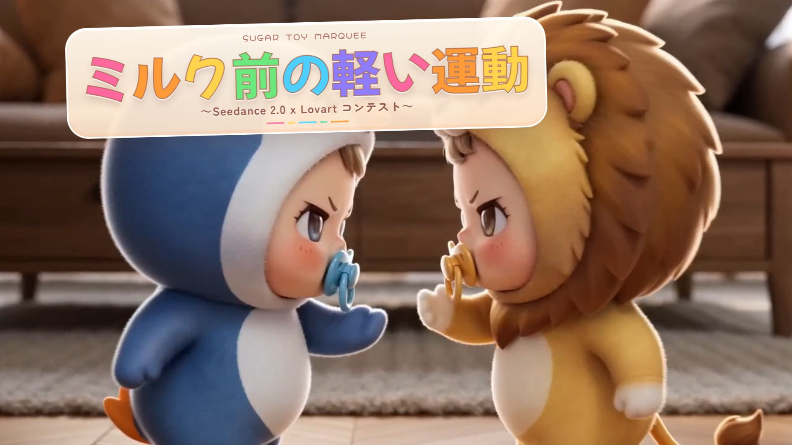
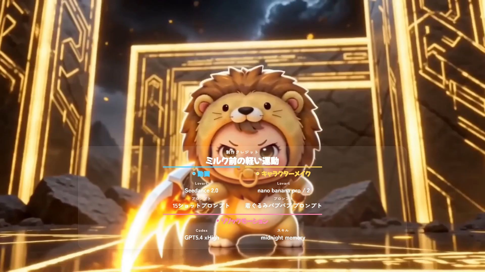
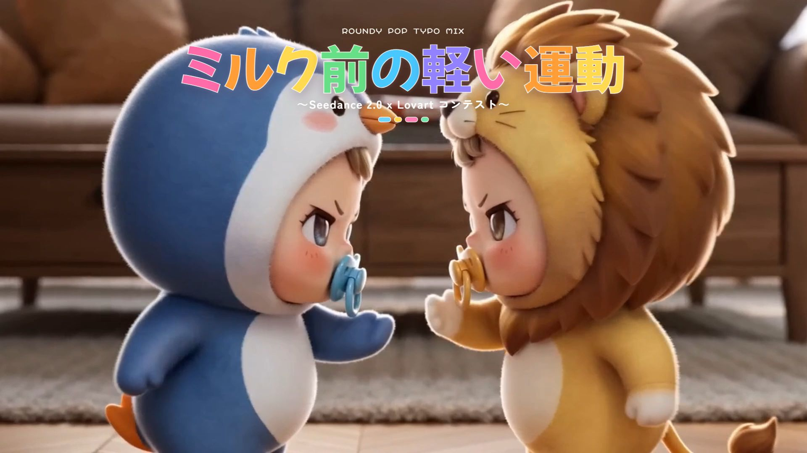
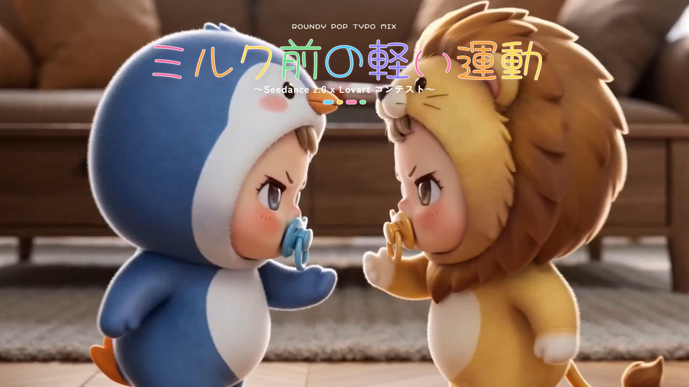
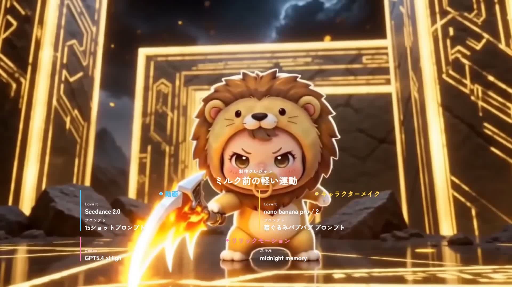

<div align="center">
  <h1>pre-milk-workout</h1>
  <p><strong>Remotion でワークアウト動画向けのポップなタイトル演出とクレジット演出を組み立てる公開ワークスペースです。</strong></p>
  <p>
    <a href="./README.md">English</a>
    ·
    <a href="./README.ja.md">日本語</a>
  </p>
  <p>
    
    
    
    <a href="./LICENSE"></a>
  </p>
  <p>
    <a href="https://sunwood-ai-labs.github.io/pre-milk-workout/">Docs</a>
    ·
    <a href="https://github.com/Sunwood-ai-labs/pre-milk-workout">Repository</a>
  </p>
  
</div>

## ✨ 概要

`pre-milk-workout` は、元動画の上にポップモーションのタイトルやクレジットを重ねるための Remotion プロジェクトです。現在は 7 種類のビジュアルバリエーション、元動画同期用の asset 準備スクリプト、単体 render と一括 render の両方に対応したスクリプトを含んでいます。

## 🚀 クイックスタート

Windows PowerShell:

```powershell
cd D:\Prj\pre-milk-workout\remotion-app
npm install
npm run preview
```

元動画は `D:\Prj\pre-milk-workout\video.mp4` に配置する前提です。このファイルはサイズが大きいため Git には含めていません。

## 🧭 ワークフロー

```powershell
cd D:\Prj\pre-milk-workout\remotion-app
npm run prepare:assets
npm run render
npm run render:all
```

- `prepare:assets` はルートの `video.mp4` を `remotion-app/public/video.mp4` に同期します。
- 同じ処理で `remotion-app/src/generated/video-metadata.jsx` を再生成します。
- `render` は既定 composition の単体出力です。
- `render:all` は `renders/versions/<tag>/` に版管理つきで一括出力します。

## 🎬 バリエーション

| Composition ID | スタイル | 出力 slug |
| --- | --- | --- |
| `PreMilkWorkoutPopMotion` | Character sheet | `01-character-sheet` |
| `PreMilkWorkoutBottleLabel` | Milk bottle label | `02-milk-bottle-label` |
| `PreMilkWorkoutStickerAlbum` | Sticker album | `03-sticker-album` |
| `PreMilkWorkoutStorybookRibbon` | Storybook ribbon | `04-storybook-ribbon` |
| `PreMilkWorkoutToyCatalog` | Toy catalog | `05-toy-catalog` |
| `PreMilkWorkoutBubbleParade` | Bubble parade | `06-bubble-parade` |
| `PreMilkWorkoutCandyMarqueeConcept` | Candy marquee concept | `07-candy-marquee-concept` |

## 🖼️ 最新サムネイル

現在 docs で参照している最新サムネイルセット:

- 版タグ: `v20260413-154900-bubble-parade-v3`
- render 出力: `renders/versions/v20260413-154900-bubble-parade-v3/`
- 生成サムネイル: `renders/versions/v20260413-154900-bubble-parade-v3/thumbs/`
- docs 公開用サムネイル: `docs/public/images/latest/`
- concept still tag: `v20260413-173100-candy-marquee`

各バリエーションごとに次の 2 種類を生成しています。

- `__title.jpg`: `00:00:03` 前後のタイトル画像
- `__credit.jpg`: `00:00:51` 前後のクレジット画像
現在の docs セットには、次の concept still も含まれます。

- `07-candy-marquee-concept__title.jpg`
- `07-candy-marquee-concept__credit.jpg`

詳細なプレビューと手順は公開 docs にまとめています: [sunwood-ai-labs.github.io/pre-milk-workout](https://sunwood-ai-labs.github.io/pre-milk-workout/).

## 🧱 リポジトリ構成

- `remotion-app/`: Remotion アプリ本体、composition 登録、render スクリプト
- `docs/`: VitePress 製 docs と追跡対象の公開アセット
- `renders/`: Git 追跡外の render 出力
- `video.mp4`: Git 追跡外の元動画

## 🧪 検証

今回の整備では次を確認対象にしています。

- `docs/` からの VitePress build
- 現在の repo 名に対する README / docs のリンクと route
- 追跡対象アセットだけを repo に含め、大容量 MP4 は ignore のまま保つこと

## 📚 ドキュメント

- 英語 docs: [Docs home](https://sunwood-ai-labs.github.io/pre-milk-workout/)
- 日本語 docs: [Japanese home](https://sunwood-ai-labs.github.io/pre-milk-workout/ja/)

## 🔗 プロンプト出典

- 15ショットのプロンプト実験と使用プロンプト: [Xの投稿を見る](https://x.com/hAru_mAki_ch/status/2043325327393595731)
- キャラクターメイク用「着ぐるみバブバブ」プロンプト: [Xの投稿を見る](https://x.com/hAru_mAki_ch/status/2043301363585819034)

## 参考プロジェクト

- ドキュメント構成とリポジトリ整理の参考として [Sunwood-ai-labs/midnight-memory](https://github.com/Sunwood-ai-labs/midnight-memory) を参照しています。

## 📝 ライセンス

このリポジトリは [MIT License](./LICENSE) で公開しています。

## フォント比較

比較表だけでなく、README 上でも画像プレビューを直接見られるようにしています。詳細は [FONT_COMPARISON.md](./FONT_COMPARISON.md) と [docs/guide/font-comparison.md](./docs/guide/font-comparison.md) を参照してください。

Candy Marquee Concept のタイトル:


Candy Marquee Concept のクレジット:



上位候補フォント:

`Mochiy Pop One`


`Mochiy Pop P One`



`Hachi Maru Pop`



### コンセプト比較表

| バリアント | タイトルプレビュー | クレジットプレビュー | メモ |
| --- | --- | --- | --- |
| `PreMilkWorkoutBubbleParade` |  |  | 現在の丸み強めな基準案です。 |
| `PreMilkWorkoutCandyMarqueeConcept` |  |  | キャンディ看板らしさを強めた派手めの別案です。 |

<div align="center">
  
</div>
