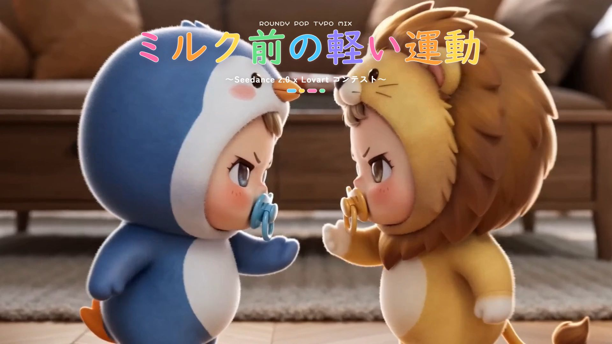
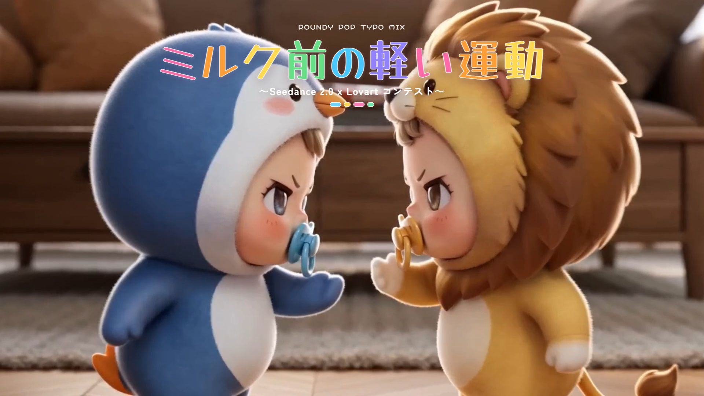

<div align="center">
  <h1>pre-milk-workout</h1>
  <p><strong>Remotion pop-motion overlays for a stylized workout video project.</strong></p>
  <p>
    <a href="./README.md">English</a>
    |
    <a href="./README.ja.md">Japanese</a>
  </p>
  <p>
    
    
    
    <a href="./LICENSE"></a>
  </p>
  <p>
    <a href="https://sunwood-ai-labs.github.io/pre-milk-workout/">Docs</a>
    |
    <a href="https://github.com/Sunwood-ai-labs/pre-milk-workout">Repository</a>
  </p>
  
</div>

## ✨ Overview

`pre-milk-workout` packages a small Remotion workspace for building playful title and credit overlays on top of a source performance video. The project currently ships seven visual variants, asset-prep scripts for syncing the source video into the app, and render scripts for both single-output and versioned batch rendering.

## 🚀 Quick Start

Windows PowerShell:

```powershell
cd D:\Prj\pre-milk-workout\remotion-app
npm install
npm run preview
```

The workspace expects the source clip at `D:\Prj\pre-milk-workout\video.mp4`. That file is intentionally excluded from Git because of size.

## 🧭 Workflow

```powershell
cd D:\Prj\pre-milk-workout\remotion-app
npm run prepare:assets
npm run render
npm run render:all
```

- `prepare:assets` links or copies the root `video.mp4` into `remotion-app/public/video.mp4`.
- The same step regenerates `remotion-app/src/generated/video-metadata.jsx`.
- `render` produces one render for the default composition.
- `render:all` writes versioned outputs under `renders/versions/<tag>/`.

## 🎬 Variants

| Composition ID | Style | Output slug |
| --- | --- | --- |
| `PreMilkWorkoutPopMotion` | Character sheet | `01-character-sheet` |
| `PreMilkWorkoutBottleLabel` | Milk bottle label | `02-milk-bottle-label` |
| `PreMilkWorkoutStickerAlbum` | Sticker album | `03-sticker-album` |
| `PreMilkWorkoutStorybookRibbon` | Storybook ribbon | `04-storybook-ribbon` |
| `PreMilkWorkoutToyCatalog` | Toy catalog | `05-toy-catalog` |
| `PreMilkWorkoutBubbleParade` | Bubble parade | `06-bubble-parade` |
| `PreMilkWorkoutCandyMarqueeConcept` | Candy marquee concept | `07-candy-marquee-concept` |

## 🖼️ Latest Preview Assets

Latest documented preview set:

- version tag: `v20260413-154900-bubble-parade-v3`
- render outputs: `renders/versions/v20260413-154900-bubble-parade-v3/`
- generated thumbs: `renders/versions/v20260413-154900-bubble-parade-v3/`
- docs-published thumbs: `docs/public/images/latest/`
- concept still tag: `v20260413-173100-candy-marquee`

Each variant now has both:

- `__title.jpg`: title frame around `00:00:03`
- `__credit.jpg`: credit frame around `00:00:51`

The latest docs-published set also includes the separate concept stills:

- `07-candy-marquee-concept__title.jpg`
- `07-candy-marquee-concept__credit.jpg`

More previews and setup notes live in the published docs: [sunwood-ai-labs.github.io/pre-milk-workout](https://sunwood-ai-labs.github.io/pre-milk-workout/).

## 🧱 Repository Layout

- `remotion-app/`: the Remotion application, composition registry, and render scripts
- `docs/`: VitePress documentation site and tracked public assets
- `renders/`: ignored render outputs
- `video.mp4`: ignored local source video

## 🧪 Verification

The current polish pass verifies:

- docs build from `docs/` with VitePress
- README and docs links/routes against the current repository name
- tracked assets stay inside the repository while large generated MP4 files remain ignored

## 📚 Documentation

- English docs: [Docs home](https://sunwood-ai-labs.github.io/pre-milk-workout/)
- Japanese docs: [Japanese home](https://sunwood-ai-labs.github.io/pre-milk-workout/ja/)

## 📝 License

This repository is released under the [MIT License](./LICENSE).

## Font Comparison

Title-only comparison stills for the `Bubble Parade` variant are also tracked in [FONT_COMPARISON.md](./FONT_COMPARISON.md) and in the docs guide at [docs/guide/font-comparison.md](./docs/guide/font-comparison.md).

### Preview Gallery

Candy Marquee Concept title:


Candy Marquee Concept credit:


Top font candidates:

`Mochiy Pop One`


`Mochiy Pop P One`


`Hachi Maru Pop`


### Concept Preview Table

| Variant | Title Preview | Credit Preview | Notes |
| --- | --- | --- | --- |
| `PreMilkWorkoutBubbleParade` |  |  | Current rounded-pop baseline. |
| `PreMilkWorkoutCandyMarqueeConcept` |  |  | Stronger signboard-style concept with a candy marquee panel. |

| Font | Preview | Roundness | Notes |
| --- | --- | --- | --- |
| Current system |  | Medium | Current baseline. Soft, but not especially thick. |
| Zen Maru Gothic Black |  | High | Clean and readable, but less marshmallow-like than the POP candidates. |
| Hachi Maru Pop |  | Very high | Cute retro rounded tone with lighter visual weight. |
| Mochiy Pop One |  | Very high | Thickest and roundest option. Strongest POP energy. |
| Mochiy Pop P One |  | Very high | Close to Mochiy Pop One, but a touch neater and sharper. |
| Yusei Magic |  | Medium | Bold marker style. Thick, but less rounded. |

<div align="center">
  
</div>
